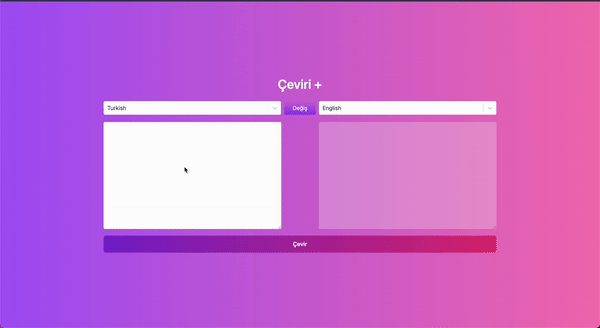

# Translate App

**Translate App** is a language translation application built with React. Users can select source and target languages, enter text, and get real-time translations by fetching data from RapidAPI.

## Features

- **Language Selection**: Users can choose source and target languages using a dropdown powered by **React Select**.
- **Real-time Translation**: Translates input text into the selected language using the RapidAPI translation service.
- **Asynchronous Data Fetching**: Translation data is fetched from the API using **Axios**.
- **State Management**: Application state is managed efficiently using **Redux Toolkit** with **Thunk** for handling async actions.
- **Responsive UI**: Styled with **Tailwind CSS** for a clean and responsive design.

## Technologies Used

- **React**: Frontend library for building UI components.
- **Redux Toolkit**: For managing global state with async logic handled via **Thunk**.
- **React Select**: Provides customizable dropdowns for language selection.
- **Axios**: For making API requests to RapidAPI.
- **Tailwind CSS**: Utility-first CSS framework for responsive and modern design.
- **RapidAPI**: Used for fetching language translation data.

# translate_app-with-redux_toolkit
